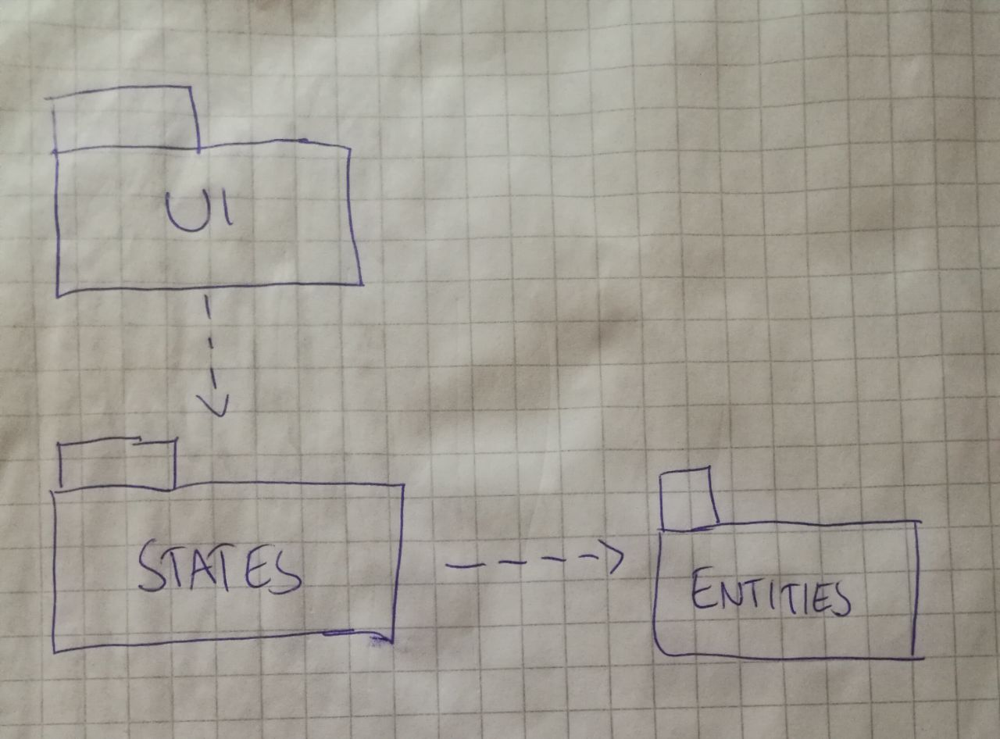
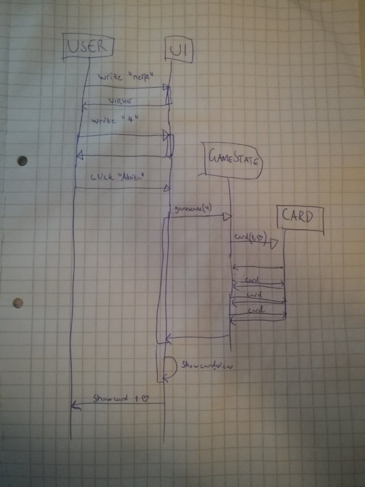
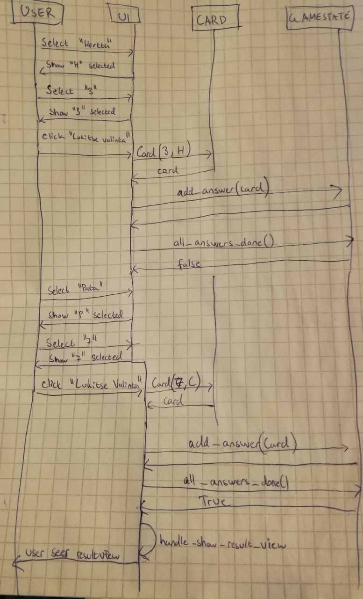
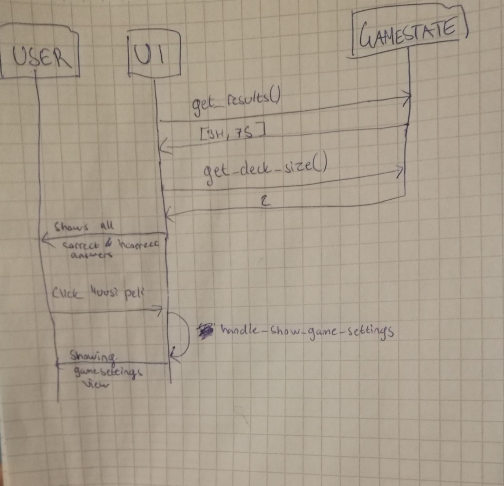

# Arkitehtuurikuvaus #
## Rakenne ##
Ohjelman koodin pakkausrakenne on seuraava:

## Käyttöliittymä ##
Sovelluksen käyttöliittymä sisältää 6 eri näkymää.

* Aloitussivu
* Pelin asetuksien asentaminen
* Peli sivu: kortit näytetään
* Peli sivu: vastausten valitseminen
* Pelin tulokset
* Huipputulokset

Näkymät ovat toteutettu omina luokkinaan ja näkymät näytetään yksi kerrallaan. Kaikki näkymät ovat UI-luokan vastuussa. Sovelluksen käyttöliittymä on pyritty eristämään sovelluslogiikasta.

## Päätoiminnallisuudet ##
Kuvataan sovelluksen toimintalogikkaa sekvenssikaavioilla.

### Pelin aloitus ###
Pelaajalta kysytään montako korttia hän haluaa koittaa muistaa ja kun pelaaja painaa aloita nappia niin pelin aloitus toimii seuraavasti:

### Vastausten valitseminen ###
Kun pelaajalle on näytetty kortit niin vastausten syöttäminen toimii seuraavasti:

### Tulosten näyttäminen ###
Pelin päätyttyä tulosten näyttäminen toimii seuraavasti:

